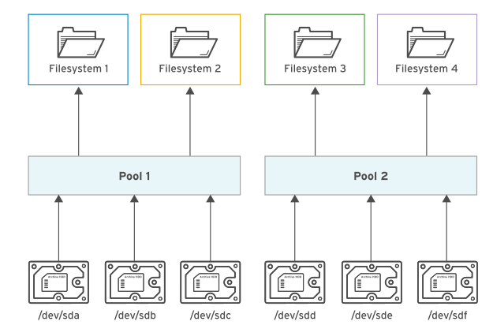

From May 2023 onwards, `VDO` and `Stratis` are no longer objectives of the `EX200` exam, as they're not present within `LVM` itself. However, for exams taken before this, they will be in place

# 1. Compressing and deduplicating storage with VDO

Virtual Data Optimizer `VDO` is a new driver which reduces disk space usage on block devices

To make use of `VDO`, we will need to install the following packages:
* `dnf install vdo kmod-kvdo`

## creating a VDO volume

```
[root@rhcsa-node-1 ~]# vdo create --name=vdo1 --device=/dev/vdb --vdoLogicalSize=10G
Creating VDO vdo1                                                                   
      The VDO volume can address 6 GB in 3 data slabs, each 2 GB.                   
      It can grow to address at most 16 TB of physical storage in 8192 slabs.       
      If a larger maximum size might be needed, use bigger slabs.                   
Starting VDO vdo1                                                                   
Starting compression on VDO vdo1                                                    
VDO instance 0 volume is ready at /dev/mapper/vdo1                                  
```
If we do not specify the `vdoLogicalSize`, which is optional, `vdo` assumed the logical size as the physical size of the block device

To query the status of our new volume, we can run: `vdo status --name=vdo1`

To list our volumes, we can run: `vdo list`

## mounting a VDO volume
```
[root@rhcsa-node-1 ~]# mkfs.ext4 /dev/vdo1                           
mke2fs 1.45.6 (20-Mar-2020)                                          
The file /dev/vdo1 does not exist and no size was specified.         
[root@rhcsa-node-1 ~]# mkfs.ext4 /dev/mapper/                        
control            root--vg-root--lv  root--vg-swap--lv  vdo1        
[root@rhcsa-node-1 ~]# mkfs.ext4 /dev/mapper/vdo1                    
mke2fs 1.45.6 (20-Mar-2020)                                          
Discarding device blocks: done                                       
Creating filesystem with 2621440 4k blocks and 655360 inodes         
Filesystem UUID: d7d422be-5691-4f80-9516-4f25cf45d7e4                
Superblock backups stored on blocks:                                 
        32768, 98304, 163840, 229376, 294912, 819200, 884736, 1605632
                                                                     
Allocating group tables: done                                        
Writing inode tables: done                                           
Creating journal (16384 blocks): done                                
Writing superblocks and filesystem accounting information: done      
                                                                     
[root@rhcsa-node-1 ~]# mkdir /mnt/vdo1                               
[root@rhcsa-node-1 ~]# mount /dev/mapper/vdo1 /mnt/vdo1              
[root@rhcsa-node-1 ~]# mount | grep vdo1                             
/dev/mapper/vdo1 on /mnt/vdo1 type ext4 (rw,relatime,seclabel)       
```

If we want to persist across reboots, we can add into `fstab`:
* `echo -e '/dev/mapper/vdo1 /mnt/vdo1 ext4 defaults,x-systemd.requires=vdo.service 0 0` >> /etc/fstab && mount -a`

You will note we've used the `x-systemd.requires=vdo.service` option. This ensures the `vdo` service is started before attempting to mount

If we now copy a file to our new directory, we can compare the original file size, and the new one with `vdostats --human-readable`

Keep in mind that `VDO volumes` are thin provisioned, so we can only see the logical space in use, and not the physical space available

# 2. Managing layered storage with stratis

`stratis` is a `service` that manages pools of physical storage devices and transparently creates and managed volumes for the newly created file systems

Stratis managed file systems are formatted uxing `XFS`



