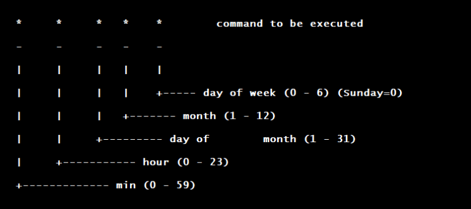

# 1. Schedule tasks using at and cron

## at
`at` is useful if you're looking to schedule a single-run of a job in the future
```
[root@rhcsa-node-1 ~]# dnf install at -y
[root@rhcsa-node-1 ~]# systemctl enable atd --now
```
Let's say we have a simple script that lists current files and prints to our terminal
```
#!/bin/bash
ls -ltr > /dev/pts/0 # use ps -a to find the tty session
```
We can use the `at` command to schedule a job
```
[root@rhcsa-node-1 ~]# at -f ls_script.sh now # will run the job now
[root@rhcsa-node-1 ~]# at -f ls_script.sh now +7 days # will run the job in 7 days time
```
To check our queue, and to remove jobs
```
[root@rhcsa-node-1 ~]# atq
2Mon Mar  6 16:17:00 2023 a root
[root@rhcsa-node-1 ~]# atrm 2
[root@rhcsa-node-1 ~]# atq
[root@rhcsa-node-1 ~]# 
```
We can also limit who can & cannot schedule jobs:
* `/etc/at.allow` - explicitly allow users to schedule jobs
* `/etc/at.deny` - prevent users from scheduling jobs

## Cron
Cron allows us to schedule jobs to run at certain intervals, multiple times



We can use `crontab -e` to edit the crontab of the current user. Let's put our script to run at 17:00 everyday
```
[root@rhcsa-node-1 ~]# crontab -e
00 17 * * * root /root/ls_script.sh
[root@rhcsa-node-1 ~]# crontab -l
00 17 * * * root /root/ls_script.sh
```
To delete the crontab we can use `crontab -d`

We can also create a cron file, with the same contents as above, as place it in the `/etc/cron.d/*` directory

`Cron` actually has four default directories:
* `/etc/cron.weekly`
* `/etc/cron.monthly`
* `/etc/cron.hourly`
* `/etc/cron.daily`

We can simply place our `ls_script.sh` file in one of these, as these directories have pre-configured run times (as evidenced in the name)

Similar to `at`, we can also allow or deny user scheduling with the two directories:
* `/etc/cron.allow`
* `/etc/cron.deny`

# 2. Start and stop services and configure services to start automatically at boot

We can list all of our possible services with:
```
[root@rhcsa-node-1 ~]# systemctl list-units --all
```
If we want to enable and start a service:
```
[root@rhcsa-node-1 ~]# systemctl unmask atd.service # not normally required, but useful to check if a service is masked (pointed to /dev/null)
[root@rhcsa-node-1 ~]# systemctl enable atd.service --now

[root@rhcsa-node-1 ~]# systemctl status atd.service
● atd.service - Job spooling tools
   Loaded: loaded (/usr/lib/systemd/system/atd.service; enabled; vendor preset: enabled)
   Active: active (running) since Mon 2023-02-27 16:06:48 GMT; 39min ago
 Main PID: 11696 (atd)
    Tasks: 1 (limit: 11214)
   Memory: 404.0K
   CGroup: /system.slice/atd.service
           └─11696 /usr/sbin/atd -f
```
If we would like to stop and disable a service, we can do the reverse
```
[root@rhcsa-node-1 ~]# systemctl disable atd.service --now
Removed /etc/systemd/system/multi-user.target.wants/atd.service.
[root@rhcsa-node-1 ~]# systemctl mask atd.service
Created symlink /etc/systemd/system/atd.service → /dev/null.
[root@rhcsa-node-1 ~]# systemctl status atd.service
● atd.service
   Loaded: masked (Reason: Unit atd.service is masked.)
   Active: inactive (dead)
```
If we have cockpit installed, we can navigate to http://localhost:9090 and go to the `Services` tab

# 3. Configure systems to boot into a specific target automatically

We can check our current default target with:
```
[root@rhcsa-node-1 ~]# systemctl get-defaul
multi-user.target
```
a `*.target` unit allows us to group units via dependencies

To list all possible targets
```
[root@rhcsa-node-1 ~]# systemctl list-units --type target # only lists active
[root@rhcsa-node-1 ~]# systemctl list-units --type target --all # lists both active and disabled
```

To set our default target
```
[root@rhcsa-node-1 ~]# systemctl set-default basic.target
Removed /etc/systemd/system/default.target.
Created symlink /etc/systemd/system/default.target → /usr/lib/systemd/system/basic.target.
```
As we can see, it's simply a `symlink` from our `target` file in `/usr/lib/systemd/system/*` to running config of `/etc/systemd/system/*`

# 4. Configure time service clients


